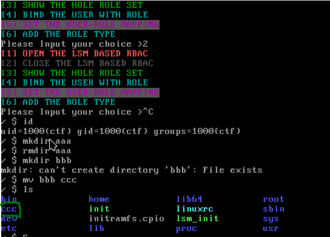

# LSM_RBAC
## 1.LSM框架模块编写
在linux-2.6.x版本之后,已经不允许在内核运行过程中动态添加模块,我们需要将写好的模块放入linux内核源码当中
然后调整`Kconfig`和`Makefile`,然后重新编译内核

## 2.RBAC设计
### 1.相关配置文件
这里采用一个权限文件`role_config`,该文件记录了所有权限对象的集合,他存放在`/etc/rbac/role_config`中
```c
role_mouse:RMDIR,RENAME,MKDIR;
role_cow:RENAME,RMDIR;
role_tiger:RMDIR,MKDIR;
role_rabbit:RENAME,MKDIR;
role_dragon:MKDIR;
role_snake:RENAME;
role_horse:RMDIR;
```
然后有一个用户对应的`user_config`,该文件记录了适用该RBAC模式的用户以及其对应的不同种类的权限,它存放在`/etc/rbac/user_config当中`
```c
1001:role_tiger
1002:role_cow:
1003:role_tiger:
```

最后还有一个文件用来控制LSM模块的启动/关闭,`/etc/rbac/gate_config`,该文件内容若为`T`则表示开启,`F`表示关闭

### 2.LSM模块
这里本来最开始是打算动态加载LKM,但是实现过程中查找网上资料发现位于内核源码中的`security_add_hooks`这个函数需要修改内核源码`security/security.c`,在源码当中填入`EXPORT_SYMBOL(security_add_hooks);`但是我查看当前内核的`/proc/kallsyms`文件时发现该文件已经经过导出,但是在加载我整个模块的时候调用`security_add_hooks`函数时直接失败了,因此我将程序重写,通过添加到内核源码的方式进行编写

这里主要是添加了三种钩子`mkdir,rmdir,rename`

```c
/*
 * Path:include/linux/lsm_hooks.h
 * Description:Security module hook list structure
 *             For use with generic list macros for common operations
 * 
 * */
struct security_hook_list hooks[] = {
    /* Desc:Initializeing a security_hook_list structure takes 
     * up a lot of space in a source file. This macro takes 
     * care of the common case and reduces the amount of 
     * text incolved
     * */
    LSM_HOOK_INIT(inode_mkdir, mkdir_hook),
    LSM_HOOK_INIT(inode_rmdir, rmdir_hook),
    LSM_HOOK_INIT(inode_rename, rename_hook)
};
```

每个钩子函数会检查上面讲到的`user_config/role_config`来查看对应用户是否具有该权限

```c
int mkdir_hook(struct inode *dir, struct dentry *dentry, umode_t mode){
    int gate = lsm_enabled(); 			//查看lsm开启/关闭状态
    int cur_cap;
    int flag;
    if(!gate){
        return 0;
    }
    printk("[Hook mkdir successfully!]");
    cur_cap = get_user_config(); 		//获取user_config以及其对应的role,关键函数
    flag = check_mkdir_auth(cur_cap);
    if(flag){
        printk(KERN_INFO "[+]mkdir accessble");
        return PASS;
    }else{
        printk(KERN_WARNING "[x]You have no permission");
        return NOPASS;
    }
}

int rmdir_hook(struct inode *dir, struct dentry *dentry){
    int gate = lsm_enabled();
    int cur_cap;
    int flag;
    if(!gate){
        return 0;
    }
    printk("[Hook rmdir successfully!]");
    cur_cap = get_user_config();
    flag = check_rmdir_auth(cur_cap);
    if(flag){
        return PASS;
    }else{
        return NOPASS;
    }
}
int rename_hook(struct inode *old_dir, struct dentry *old_dentry, struct inode *new_dir, struct dentry *new_dentry){
    int gate = lsm_enabled();
    int cur_cap;
    int flag;
    if(!gate){
        return 0;
    }
    printk("[Hook rename successfully!]");
    cur_cap = get_user_config();
    flag = check_rename_auth(cur_cap);
    if(flag){
        return PASS;
    }else{
        return NOPASS;
    }
}
```

### 3.USER APP

这里简单实现了一个命令行的终端APP,大致的功能局限于修改配置文件


正处于开发阶段,功能暂时不完善...

## 3.环境搭建

内核版本:`linux-5.16.1`

文件系统镜像:`busybox-1.33`

gcc版本:`gcc-10`


## 4.实现步骤

首先就是编写lsm模块,然后将对应的Kconfig和Makefile写出来,这里我们可以直接参考其他LSM模块的配置

这里我们可以通过`include/linux/lsm_hooks.h`中寻找hook点

这里我们选择的hook点是`inode_mkdir,inode_rename,inode_rmdir`

```c
@inode_mkdir:                                                          
 Check permissions to create a new directory in the existing directory 
 associated with inode structure @dir.                                 
 @dir contains the inode structure of parent of the directory          
 to be created.                                                        
 @dentry contains the dentry structure of new directory.               
 @mode contains the mode of new directory.                             
 Return 0 if permission is granted.                                    
```

该头文件当中有很多关于这些挂载点的介绍,然后我们需要按照下面的形式进行挂载,其中`security_hook_list`和`security_add_hooks`均为内核提供的函数,此外我们就可以往其中添加我们的钩子函数

```c
static struct security_hook_list pwh_hooks[] __lsm_ro_after_init = {
    /* Desc:Initializeing a security_hook_list structure takes 
     * up a lot of space in a source file. This macro takes 
     * care of the common case and reduces the amount of 
     * text incolved
     * */
    LSM_HOOK_INIT(inode_mkdir, pwh_mkdir_hook),
    LSM_HOOK_INIT(inode_rmdir, pwh_inode_rmdir),
    LSM_HOOK_INIT(inode_rename, pwh_inode_rename), 
};

void __init pwh_add_hooks(void){
    printk(KERN_WARNING "[LSM_INIT]\n");
    security_add_hooks(pwh_hooks,ARRAY_SIZE(pwh_hooks), "pwh");

}

static int __init pwh_init(void){
    pwh_add_hooks();
    return 0;
}

__initcall(pwh_init);
```


编写完之后需要进行编译,这里我们需要将咱们编写的模块(PWH)选上,我们同时可以将其他LSM给取消


如果你觉得自己没关干净,我们可以到这里的选项来更改默认的LSM模块


再然后就是正常编译,在这个步骤当中我肤浅的认为文件系统必须是要十分完善的,所以最开始一直用的ubuntu的文件系统,这导致了我的编译过程十分缓慢且痛苦,之后同门实验得出简单的busybox+bzImage就可以正常实验,学到了


然后我们可以查看一下各种配置文件


这里可以看到我所设计的一个权限对应情况,一个用户对应一个权限对象,而一个权限对象是可以被多个用户进行映射的

我们可以知道1000用户对应的snake_role是可以mkdir,rmdir的,这里我们来查看


这里发现咱们是正常hook的,rmdir可以正常通过,但是rename这个文件夹就无法pass


可以看到这里bbb文件夹并没有被改名字

最后就是用户APP的编写,这里简单实现为一个终端命令行,简单测试一下关闭lsm模块的功能,



当我们调用之后可以看到1000用户的role管理已经失效,可以正常修改文件名

## 5.遇到的困难

1. 第一个问题就是当我挂上mkdir的钩子函数之后,发现整个内核就被卡在 `clocksource: Switched to clocksource tsc`这行日志,内核无法正常启动,之前怀疑可能是mkdir函数钩子组织了内核加载过程中某个用户调用mkdir,但是后面当我给予全部权限之后仍然无法正常启动,这里仍是一个难题
2. 内核环境编译的问题,在编写过程中难得反而不是内核编程,而是环境的适配
